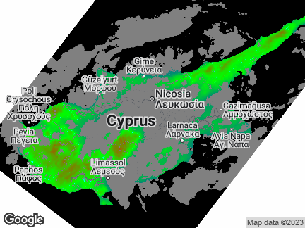
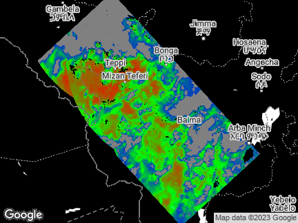
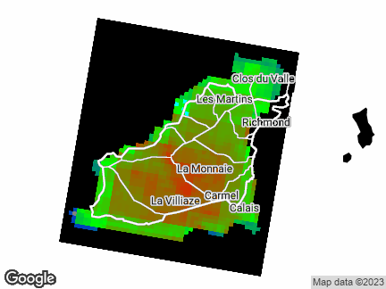
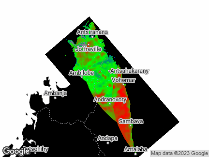
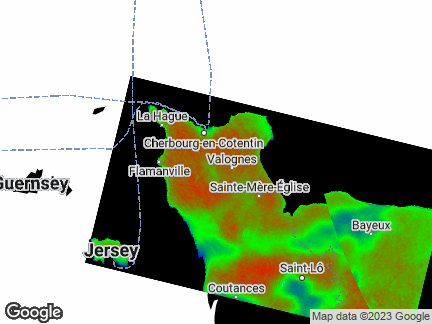
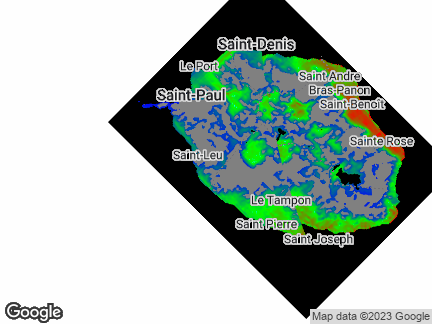
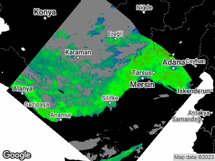

Channel Islands + Normandy (wrong?)

Cyprus

Danube River (wrong?)

Ethiopian National Parks

Guernsey, English Channel

Istanbul

Northern Madagascar

Normandy

Réunion Island, E of Madagascar

South of Turkey

