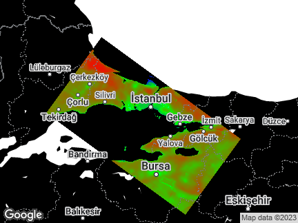
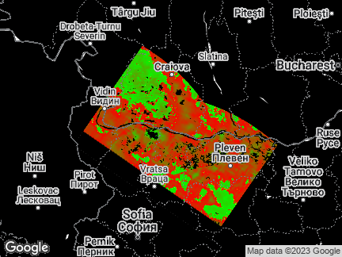
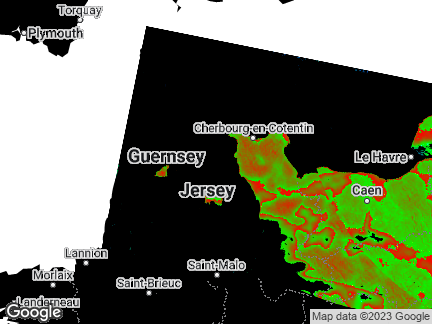

## Image Locations
0 - (Sea) S of Tasmania -49.34310914710364 150.5908625415843
20 - (Sea) W Pacific Ocean -51.07153100749119 -174.3699772813332
Star reflections? 35 - (Sea) S Pacific Ocean -45.13506929877607 -150.7597362469943
Look at National Parks? 63 - (Land) English Channel, partially obscured by clouds 48.57841795504974 7.110460509384765
Very good quality! 83 - (Land) Greece + Istanbul 36.50086832922141 33.0898587170316